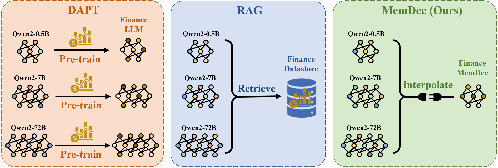
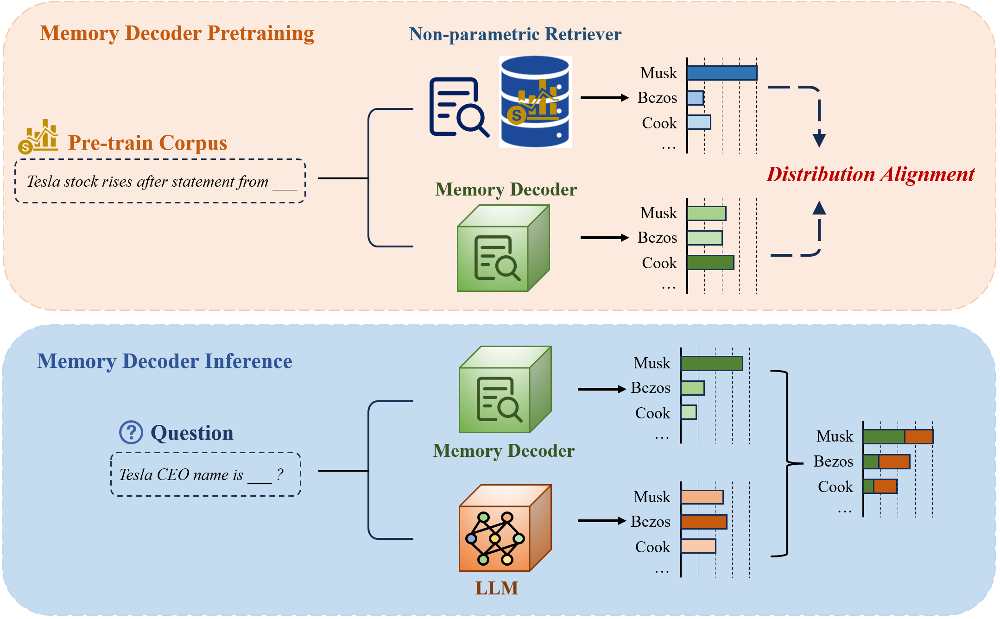

#  Memory Decoder: A Pretrained 📚, Plug-and-Play 🔗 Memory for Large Language Models 

<div align="center">

[](https://www.arxiv.org/abs/2508.09874)
[](https://huggingface.co/Clover-Hill/MemoryDecoder-gpt2-small)
[]()

</div>

<p align="center" style="font-size: larger;">
  <a href="https://www.arxiv.org/abs/2508.09874">Memory Decoder: A Pretrained, Plug-and-Play Memory for Large Language Models</a>
</p>

<p align="center">
  <em><strong>NeurIPS 2025 Poster</strong></em>
</p>

<p align="center">

</p>

## 📖 Overview

Memory Decoder introduces a novel paradigm for domain adaptation that bridges the gap between non-parametric retrieval methods and parametric fine-tuning approaches. By pre-training a compact transformer decoder to internalize retrieval patterns, Memory Decoder provides the benefits of both worlds:

- ✨ **Plug-and-Play**: A single Memory Decoder enhances any model sharing the same tokenizer
- 🚀 **Efficient Inference**: No retrieval overhead - just parallel forward passes  
- 🎯 **Domain Expertise**: Captures long-tail knowledge like non-parametric methods
- 🔒 **Preserves Capabilities**: Original model parameters remain unchanged

Unlike traditional approaches that either require expensive retraining (DAPT) or introduce significant inference latency (RAG), Memory Decoder offers efficient domain adaptation through a pretrained memory component that seamlessly integrates with existing models.

<p align="center">

</p>

## 🚀 Quick Start

### 🔧 Environment Setup

We run on **CUDA 12.4** with the following core dependencies:
- **faiss-gpu 1.11.0** (with cuvs support)
- **PyTorch 2.6.0**

#### Step 1: Install FAISS-GPU
```bash
conda install -c pytorch -c nvidia -c rapidsai -c conda-forge libnvjitlink faiss-gpu-cuvs=1.11.0
```

#### Step 2: Install PyTorch
```bash
pip install torch==2.6.0 torchvision==0.21.0 torchaudio==2.6.0
```

#### Step 3: Install Other Dependencies
```bash
pip install transformers datasets accelerate pyarrow evaluate loguru wandb tqdm pickle
```

### 📊 Evaluate and Use Memory Decoder

We provide the checkpoint of gpt2-small Memory Decoder used in our experiments 🤗[gpt2-small Memory Decoder](https://huggingface.co/Clover-Hill/MemoryDecoder-gpt2-small). Simply download this checkpoint and 🤗[wikitext-103 dataset](https://huggingface.co/datasets/Salesforce/wikitext) from huggingface and run the following scripts:

#### 📝 Data Preprocessing
```bash
# scripts/preprocess_dataset.sh
TOKENIZER="/path/to/tokenizer(model)/directory"
OUTPUT_DIR=./dataset/wikitext-gpt2

python utils/preprocess_dataset.py \
    --dataset_name /path/to/wikitext \
    --dataset_config_name wikitext-103-raw-v1 \
    --tokenizer_path ${TOKENIZER} \
    --output_dir ${OUTPUT_DIR} \
    --num_proc 32
```

#### 📈 Evaluate Base Model
```bash
# scripts/evaluate_base_gpt.sh
DATASET=/path/to/dataset
MODEL=/path/to/base/model
OUTPUT_DIR=tmp/

NCCL_P2P_DISABLE=1 NCCL_IB_DISABLE=1 CUDA_VISIBLE_DEVICES=0 python \
    -m train_base \
    --model_name_or_path ${MODEL} \
    --dataset_name ${DATASET} \
    --per_device_eval_batch_size 16 \
    --do_eval \
    --eval_subset test \
    --output_dir ${OUTPUT_DIR} \
    --report_to none
```

#### 🎯 Evaluate with Memory Decoder
```bash
# scripts/evaluate_joint_gpt2.sh
DATASET=/path/to/dataset
MODEL=/path/to/base/model
KNN_PATH=/path/to/memory/decoder
OUTPUT_DIR=tmp/

python -m evaluate_joint \
    --do_test \
    --model_name_or_path ${MODEL} \
    --dataset_name ${DATASET} \
    --dataset_split_name test \
    --per_device_eval_batch_size 16 \
    --output_dir ${OUTPUT_DIR} \
    --knn_temp 1 \
    --lmbda 0.55 \
    --knn_generator_path ${KNN_PATH} \
    --report_to none
```

### 🏆 Performance Results on WikiText-103

|   Model    | Base | +MemDec | PPL Decrease |
|:----------:|:----:|:-------:|:-----------:|
| GPT2-small | 24.89 | **13.36** | -46.4% |
| GPT2-medium | 18.29 | **12.25** | -33.0% |
| GPT2-large | 15.80 | **11.53** | -27.0% |
| GPT2-xl | 14.39 | **10.93** | -24.0% |

### 💡 Generation Example

#### Step 1: Import Libraries and Initialize Models

```python
from memDec import MemoryDecoder
import transformers
from transformers import AutoModelForCausalLM
from loguru import logger

# Define paths to your models
base_lm_path = "/path/to/base/model/gpt2-xl"
knn_generator_path = "/path/to/memdec-gpt2-small"

# Load tokenizer and models
tokenizer = transformers.AutoTokenizer.from_pretrained(base_lm_path)
base_lm = AutoModelForCausalLM.from_pretrained(base_lm_path)
knn_generator = AutoModelForCausalLM.from_pretrained(knn_generator_path)
```

#### Step 2: Prepare Models and Create Joint Model

```python
# Resize embeddings and set to evaluation mode
base_lm.resize_token_embeddings(len(tokenizer))
knn_generator.resize_token_embeddings(len(tokenizer))
base_lm.eval()
knn_generator.eval()

# Create the joint Memory Decoder model
joint = MemoryDecoder(base_lm, knn_generator, lmbda=0.55, knn_temp=1.0).to("cuda")
```

#### Step 3: Generate Text and Compare Results

```python
# Prepare input prompt
prompt = "As with previous Valkyira Chronicles games , Valkyria Chronicles III is"
inputs = tokenizer(prompt, return_tensors="pt").to("cuda")

# Generate with Memory Decoder
out_ids = joint.generate(**inputs, max_new_tokens=20, do_sample=False)
logger.info(f"Memory Decoder output: {tokenizer.decode(out_ids[0], skip_special_tokens=True)}")

# Generate with base model for comparison
out_ids = base_lm.generate(**inputs, max_new_tokens=20, do_sample=False)
logger.info(f"Base Model output: {tokenizer.decode(out_ids[0], skip_special_tokens=True)}")
```

**📊 Generation Results Comparison:**

| Model | Generated Continuation |
|-------|------------------------|
| **Memory Decoder** 🎯 | *"...is a **role-playing** video game developed by Sega and published by Sega for the PlayStation 2."* |
| **Base Model** | *"...is a turn-based strategy game. The player takes control of a squad of Valkyria soldiers..."* |

> [!NOTE]
> Memory Decoder correctly identifies Valkyria Chronicles III as a **role-playing game** (factually accurate), while the base model incorrectly predicts it as a strategy game. 

## 🛠️ Training Memory Decoder

### 📁 Repository Structure

Our codebase is organized as follows to facilitate both training and evaluation:

```
MemoryDecoder/
├── knn_utils/
│   ├── build_index.py        # Build FAISS index for efficient search
│   ├── saveEmbedMulti.py     # Save embeddings with multi-GPU support
│   └── saveKNNMulti.py       # Search and save KNN distributions
├── scripts/
│   ├── evaluate_base_gpt.sh  # Evaluate base model
│   ├── evaluate_joint_gpt2.sh # Evaluate with Memory Decoder
│   ├── preprocess_dataset.sh # Preprocess datasets
│   ├── save_pipeline.sh      # Complete KNN signal pipeline
│   └── train_memdec.sh       # Train Memory Decoder
├── utils/
│   ├── cal_loss.py          # Loss calculation utilities
│   └── preprocess_dataset.py # Dataset preprocessing
├── demo/                      # Demo scripts
│   ├── memDec.py  # Class for Memory Decoder Generation
│   └── generation_example.py # Generation demonstration
├── train_base.py             # Base model training/evaluation
├── train_memdec.py           # Memory Decoder training
└── evaluate_joint.py         # Joint evaluation interface
```

### 🔄 Training Pipeline

#### 1️⃣ Preprocess Dataset
Tokenize and group text for efficient processing:
```bash
bash scripts/preprocess_dataset.sh
```

#### 2️⃣ Build KNN Training Signals

Three-step process for creating supervision signals:

- Save Embeddings

Extract and save hidden representations from the pretrained model:
```bash
accelerate launch \
    --config_file ${ACCELERATE_CONFIG} \
    -m train_base \
    --model_name_or_path ${MODEL_TO_SAVE} \
    --dataset_name ${DATASET} \
    --do_eval --eval_subset ${SUBSET} \
    --per_device_eval_batch_size ${BATCH_SIZE_EVAL} \
    --output_dir ${OUTPUT_DIR} \
    --dstore_dir ${DSTORE_DIR} \
    --save_knnlm_dstore \
    --report_to none
```

- Build IVFPQ Index

Create an efficient index for fast nearest neighbor search:
```bash
python -m knn_utils.build_index \
    --dstore_path ${DSTORE_PATH} \
    --num_keys_to_add_at_a_time ${NUM_KEYS_TO_ADD} \
    --ncentroids ${NCENTROIDS} \
    --code_size ${CODE_SIZE} \
    --probe ${PROBE}
```

- Search KNN Distributions

Generate KNN probability distributions as training signals:
```bash
accelerate launch \
    --config_file ${ACCELERATE_CONFIG} \
    -m knn_utils.saveKNNMulti \
    --model_path ${MODEL_TO_SAVE} \
    --dstore_path ${DSTORE_PATH} \
    --val_path ${VAL_PATH} \
    --index_path ${INDEX_PATH} \
    --output_path ${OUTPUT_PATH} \
    --k ${K} \
    --knn_temp ${KNN_TEMP} \
    --probe ${PROBE} \
    --batch_size ${BATCH_SIZE_KNN} \
    --ignore_first True \
    --knn_gpu
```

The complete pipeline is available in:
```bash
bash scripts/save_pipeline.sh
```

> [!IMPORTANT]
> Both embedding saving and KNN distribution search support multi-card multi-node inference/searching. Ensure your `accelerate` configuration is properly set up for distributed computing to maximize efficiency.

#### 3️⃣ Start Training

Launch Memory Decoder training:
```bash
bash scripts/train_memdec.sh
```

> [!NOTE]
> The training interface is implemented in `train_memdec.py` and supports resuming from checkpoints automatically.

## 🙏 Acknowledgments

This implementation is inspired by the excellent work in [knn-transformers](https://github.com/neulab/knn-transformers). We are grateful for their pioneering contributions to retrieval-augmented language modeling.

## 📧 Contact

For questions and discussions, feel free to email: **maximus.cao@outlook.com**

## 📚 Citation

If you find Memory Decoder helpful in your research, please consider citing:

```bibtex
@article{cao2025memory,
  title={Memory decoder: A pretrained, plug-and-play memory for large language models},
  author={Cao, Jiaqi and Wang, Jiarui and Wei, Rubin and Guo, Qipeng and Chen, Kai and Zhou, Bowen and Lin, Zhouhan},
  journal={arXiv preprint arXiv:2508.09874},
  year={2025}
}
```